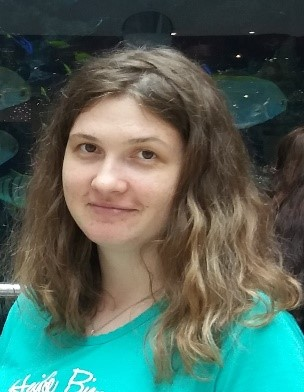

# Anzhela Chernenko
*Location:* **Kherson**  

*Email:* **anzhela.ch.v@gmail.com**

*Phone:* **+380677857156**

***

### Career objective:

Get a job in a friendly team with a good sense of humor

### Education:

2005 - 2010. International University of business and law. Master of Financier

* Courses:
    + 03.2020. ITEA. PHP base;
    + 05.2019. Prog Kiev UA. Front-end.


* Experience:
    1) 2017 - 2019. Self-employed person;
    2) 2015 - 2017. Kovalev V. Manager.

### Technical proficiencies:
>HTML, CSS, JS, Figma, Bootstrap, Jquery, Jira, PHP

### Languages:

* Russian - native;

* Ukrainian - native;

* English - intermediate.

### GitHub link:

[Anzhelach GitHub link](https://github.com/AnzhelaCh?tab=repositories)

### Code review:

```
<div class="video__background">
            <div class="header__subtitle">
                <p class="header__subtitle__style">The best open page template for</p>
                <p class="title">Web Professionals</p>
            </div>
            <div class="container">
                <div class="row">
                    <div class="header__form">
                        <form action="#" method="get">
                            <input tabindex="1" required class="fields" type="text" name="full__name" id="name"
                                   placeholder="Full name">
                            <input tabindex="2" required class="fields" type="email" name="email" id="email"
                                   placeholder="E-mail">
                            <input tabindex="3" required class="fields" type="tel" name="phone" id="phone"
                                   placeholder="Phone">

                            <input class="submit" type="submit" style="color: white; text-transform: uppercase;"
                                   value="Get started now!">
                        </form>
                    </div>
                </div>
            </div>
        </div>
```
  